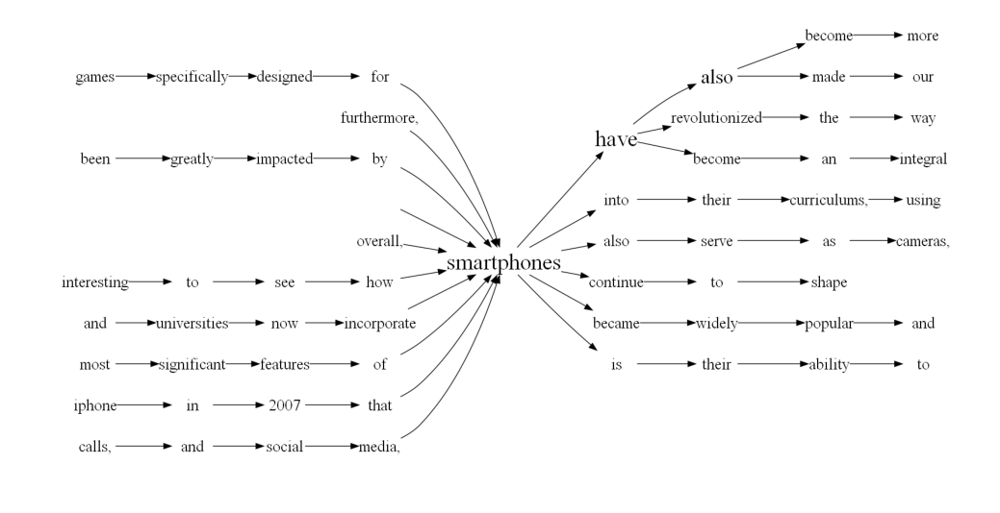

# Topic-Modelling-using-Text-visualization\
The Text Analysis Visualizer is a Python project aimed at enhancing text analysis by leveraging advanced visualizations. It offers a comprehensive set of tools to explore and interpret textual data, enabling users to uncover key topics and discover hidden connections within their dataset.

### Features
1. Conduct exploratory data analysis on text datasets.
2. Utilize word clouds and word trees for visualizing the frequency and relationships between words.
3. Interactive visualizations enable word selection and the discovery of related phrases.
4. Interpret complex text data and uncover word associations.

### Usuage
1. Clone the repository: git clone [https://github.com/onkar-99/Topic-Modelling-using-Text-visualization](https://github.com/onkar-99/Topic-Modelling-using-Text-visualization)
2. Navigate to the project directory: cd text-analysis-visualizer
3. Install the Graphviz software from the link mentioned in the IVTopicModelling.ipynb
4. Change this path as per your system path and add it to the environment PATH variables.  "C:\Program Files\Graphviz\bin"
5. Run the IVTopicModelling.ipynb file from Jupyter Notebook. 

### Visualizations:
#### 1. Word Cloud

#### 2. Word Tree

